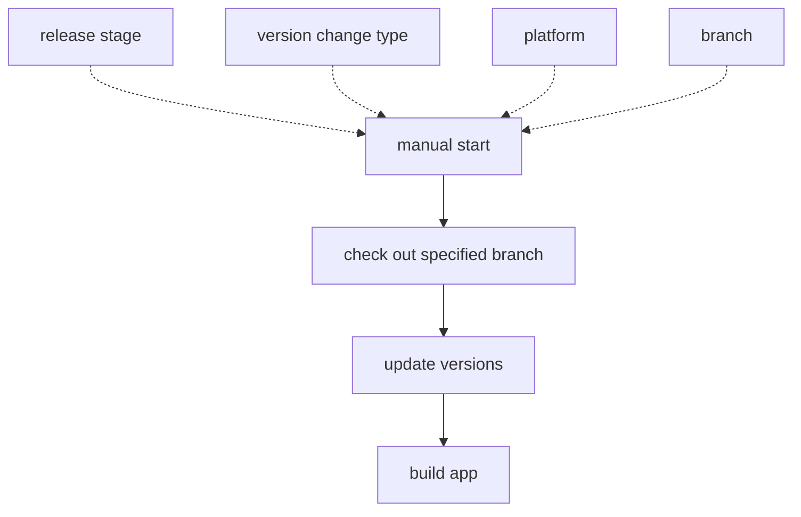

# mobile-release-actions

A monorepo of GitHub actions used for mobile releases.

* [tagging](./tagging)
  * Automate the versioning process for mobile applications.
* [eas-build](./eas-build)
  * Assists in building and submitting your app using [EAS](https://docs.expo.dev/eas/)

## Release Process

At a very basic level, the release process is as follows:

## Full Workflow Examples

* [Using GitHub tagging](./examples/release-github.yml)
* [Using package.json versioning](./examples/release-package.yml)

## Contributing

This repo uses [int128/release-typescript-action](https://github.com/int128/release-typescript-action) to automatically publish a new version on merge to main.
