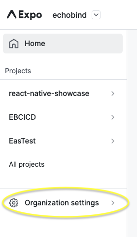
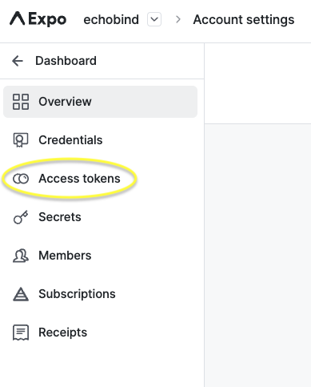
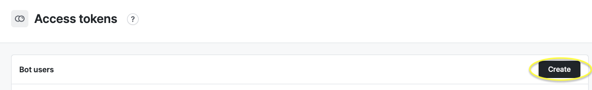
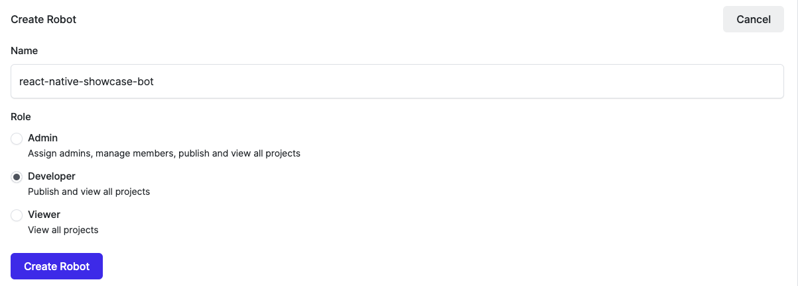
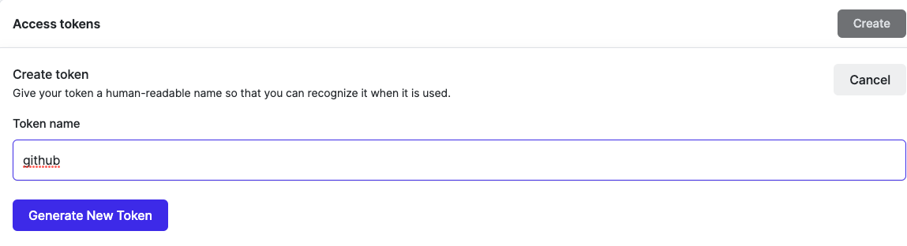

# eas-build

This action handles deploying your mobile app through [EAS](https://docs.expo.dev/eas/). It calls `eas build` with the `--auto-submit` flag to handle the deployment. 

__You must [install EAS CLI](https://github.com/marketplace/actions/expo-github-action) in your workflow prior to using this action.__

## Usage

```yaml
- uses: echobind/mobile-release-actions/eas-build@v1
  with:
    platform: ${{ github.event.inputs.platform }}
    profile: ${{ github.event.inputs.releaseStage }}
    submit: ${{ github.event.inputs.releaseStage != 'alpha' }}
```

## Inputs

| Name       | Type                       | Default      | Description                                          |
| ---------- | -------------------------- | ------------ | ---------------------------------------------------- |
| `platform` | `ios`, `android`, or `all` | `all`        | Platform to build for.                               |
| `profile`  | `string`                   | `production` | Build and submit profile to use.                     |
| `submit`   | `boolean`                  | `true`       | Whether to submit the build to app store/play store. |

## Setting up EAS CI Token

In order to authenticate witht he EAS CLI through GitHub, you need to generate a service token and it under the secrets for the repo. 

Navigate to `organization settings` in Expo Dashboard



Navigate to `Access Tokens`



Create a new bot user if one doesn't already exist that you want to use





Create an access token for the bot user



Once you have this token, add it in GitHub under https://github.com/${ORG_NAME}/${REPO_NAME}/settings/secrets/actions named `EXPO_CI_TOKEN`. Now, you can use this token during the EAS CLI installation step of the workflow using `${{ secrets.EXPO_CI_TOKEN }}`, as shown in the example workflows. 