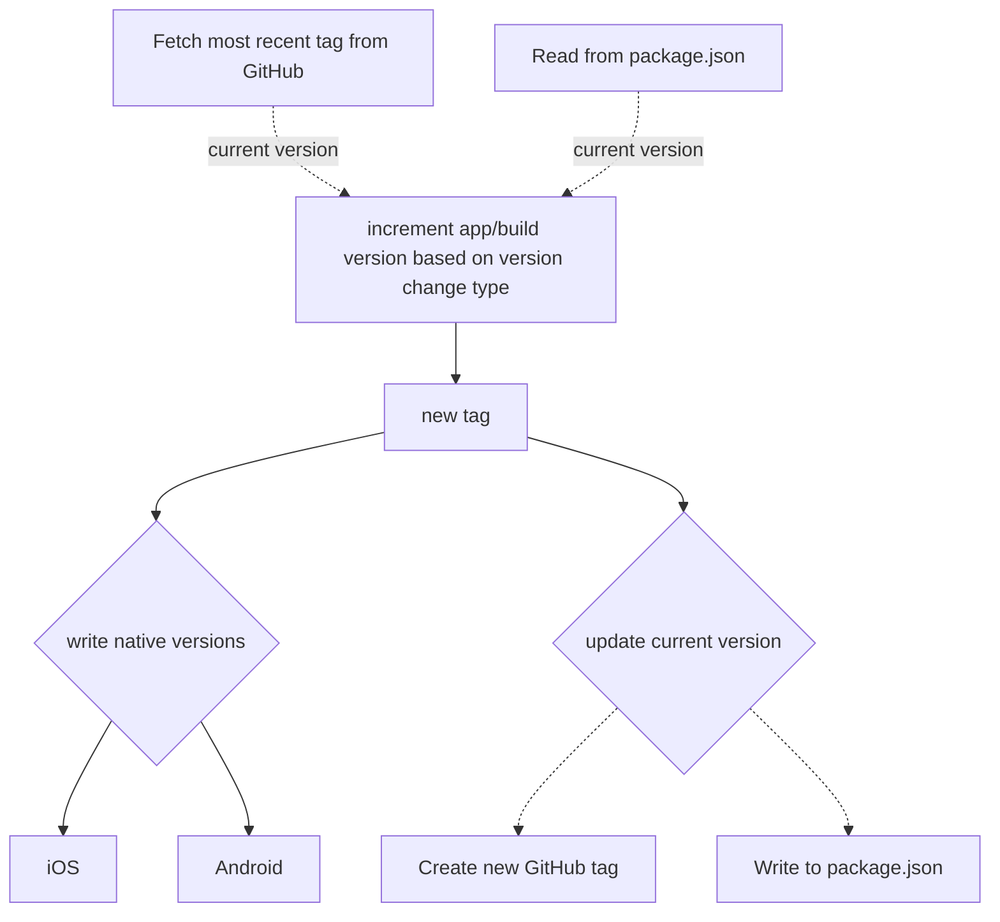

# tagging

This action automates the versioning process for mobile applications.

* Automatically writes native app versions and build versions (build number on iOS and version code on Android)
* Manage app version for both platforms through GitHub or `package.json`



## Usage

```yaml
- uses: echobind/mobile-release-actions/tagging@v1
  with:
    branch: ${{ github.event.inputs.branch }}
    version-change-type: ${{ github.event.inputs.versionChangeType }}
    build-version: ${{ github.run_number }}
```

## Inputs

| Name                  | Type                                 | Default        | Description                                                                                                                                                   |
| --------------------- | ------------------------------------ | -------------- | ------------------------------------------------------------------------------------------------------------------------------------------------------------- |
| `github-tagging`      | `boolean`                            | `true`         | Whether to manage current version through tags on Github. If this is false, it will manage the current version using the version specified in `package.json`. |
| `github-auth-token`   | `string`                             | `github.token` | GitHub token                                                                                                                                                  |
| `create-tag`          | `boolean`                            | `true`         | Whether to create the tag on GitHub. Useful if you want to build off of a branch to test but don't want to tag it.                                            |
| `branch`              | `string`                             | `main`         | Branch to create the tag off of.                                                                                                                              |
| `version-change-type` | `major`, `minor`, `patch`, or `none` | `none`         | Type of version change to make                                                                                                                                |
| `build-version`       | `string`                             | `1`            | Build version (see [terminology](#terminology)). A good value for this is `github.run_number`.                                                                |

## Terminology

* `tag`
  * Corresponds to value used in GitHub, which comes app version and build version.
  * Ex: `v1.0.0-1`
* `version`
  * Corresponds to app version, not including build version.
  * Ex: `1.0.0`
* `build-version`
  * Corresponds to build number on iOS and version code on Android. This must always increment and be higher than previous released version. 
  * Ex: `1`

## Tagging Process

The process for tagging utilized by this action is specific to mobile apps and allows for the usual major, minor, and patch version bumps, as well as no version bump, which only changes the build version.

As an example, if your most recent tagged version is `v1.0.0-1`:
* A **major** bump will result in `v2.0.0-${buildVersion}`
* A **minor** bump will result in `v1.1.0-${buildVersion}`
* A **patch** bump will result in `v1.0.1-${buildVersion}`
* No bump being indicated will result in `v1.0.0-${buildVersion}`.